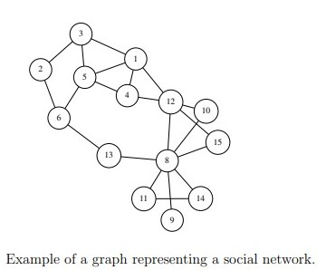

# Recommending friends on social networks

# Description
in this project we will use various data structures to implement a new friends recommendation system. This is achieved by utilizing various information about the users. but the main factor used for recommending a new friend to a user is how well these
two users are connected. A social network such as Facebook can be represented as undirected
graph such as the one shown in the Figure below. We can use the information contained in the graph
to select the top candidate friends for a given user. **There are many ways to do this, but we
will focus on two methods**:

1. Popular users: In this method, we recommend the most popular users in the graph, that is nodes with the highest degrees (number of neighbors).

    for example, If we want to recommend 4 new friends for user 3 using the popular users
method, we recommend: (see the figure below)
    * (a) User 8, which has degree 7.
    * (b) User 12, which has degree 5.
    * (c) User 4, which has degree 3.
    * (d) User 6, which has degree 3 (we break ties according to user ID)
2. Common neighbors: In this method, we recommend users who have the most common
friends with the user.

    For example, If we want to recommend 4 new friends for user 3 using the common neighbors method, we recommend: (see the figure below)
    * (a) User 4, which has 2 common neighbors with 3, nodes 1 and 5.
    * (b) User 6, which has 2 common neighbors with 3, nodes 2 and 5.
    * (c) User 12, which has 1 common neighbor with 3, node 1.
    * (d) User 8, which has 0 common neighbors with 3 (we break ties according to user ID)

# Important notes
In this section, we present the necessary data structures  and some clarification of the program.

1. ## Implementing a top k priority queue
    To recommend top k users, we use a priority queue that keeps only the top k elements and
serves them in decreasing order of priority
2. ##  Implementing a map 
    In this step, we write a binary search tree implementation of a map

3. ## Representing the social network
    To represent the friendship we use undirected graph we will also use adjacency list representation, but instead of an array of lists, we use a map
    of lists. Each list in the map represents the neighbors of a node

4. ## The friends recommender
     The class recommender implements the two friends recommendation methods discussed
     above

# visuals

